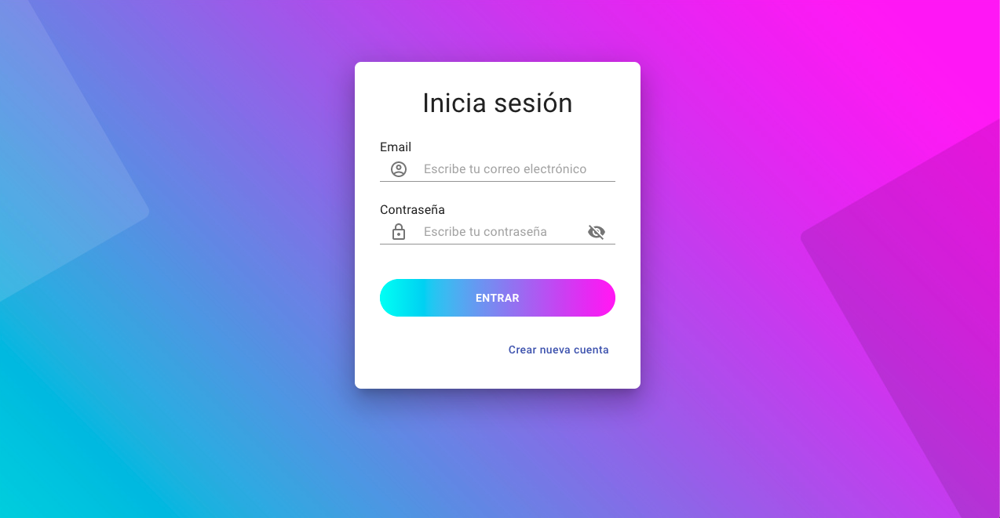
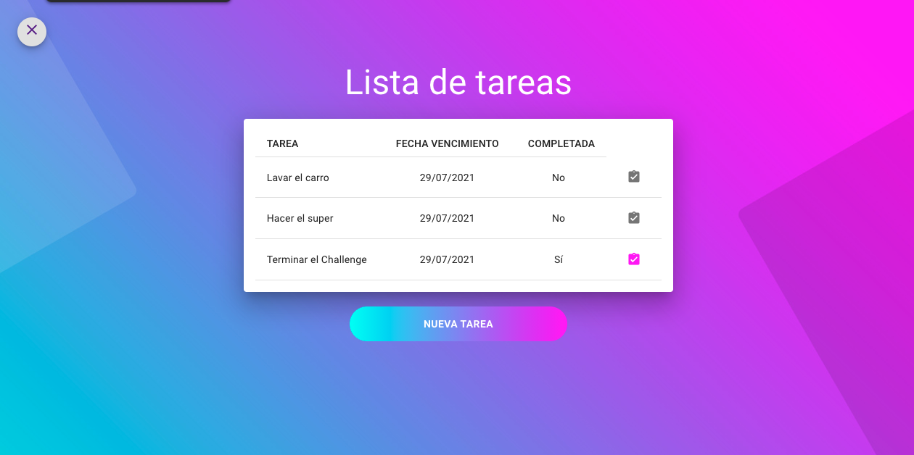

<h1>ToDo Challenge<h1>

Funciones de la aplicación:
- Crear una cuenta
- Iniciar sesión en su cuenta
- Crear una tarea
- Agregar fecha de vencimiento a la tarea
- Marcar una tarea como completada
- Mostrar la lista de tareas

### `Instrucciones`

Este repositorio contiene dos preoyectos: el backend en NodeJS y el frontend en ReactJS.

Pasos para ejecutar el frontend:
- Clonar el repositorio con el comando "git clone https://gitlab.com/antoniomefa/todo-app.git"
- Desde la terminal, ingresar al directorio del proyecto "todo-app"
- Ejecutar el comando "npm i" para instalar las dependecias
- Ejecutar el comando "npm run start" para correr el proyecto en http://localhost:3000

Pasos para ejecutar el backend:
- Instalar y correr MongoDB en local. Crear una nueva base de datos con el nombre "ToDo_DB" la cual correrá en "localhost:27017" para que la aplicación NodeJS se conecte correctamente.
- Desde la terminal, ingresar al directorio del proyecto "todo-API"
- Ejecutar el comando "npm i" para instalar las dependecias
- Ejecutar el comando "nodemon app.js" para correr el proyecto en http://localhost:5000

### `Descripción`

Aplicación Frontend:
- Desarrollado en ReactJS
- Interface diseñada utilizando componentes de Material UI
- Enrutamiento con React-Router
- Uso de Componentes de función
- Manejo de estado con useContext

Aplicación Backend:
- Desarrollado en NodeJS con Express
- Hace uso del ODM Mongoose para conectarse a MongoDB desde Express
- Validaciones con hapi/joi
- Encriptado de contraseñas

Pantalla de login

Pantalla de Lista de tareas

Por: Antonio Mendiola Farías - 2021
